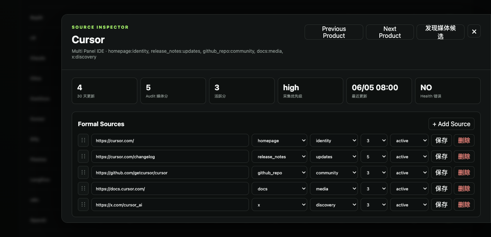
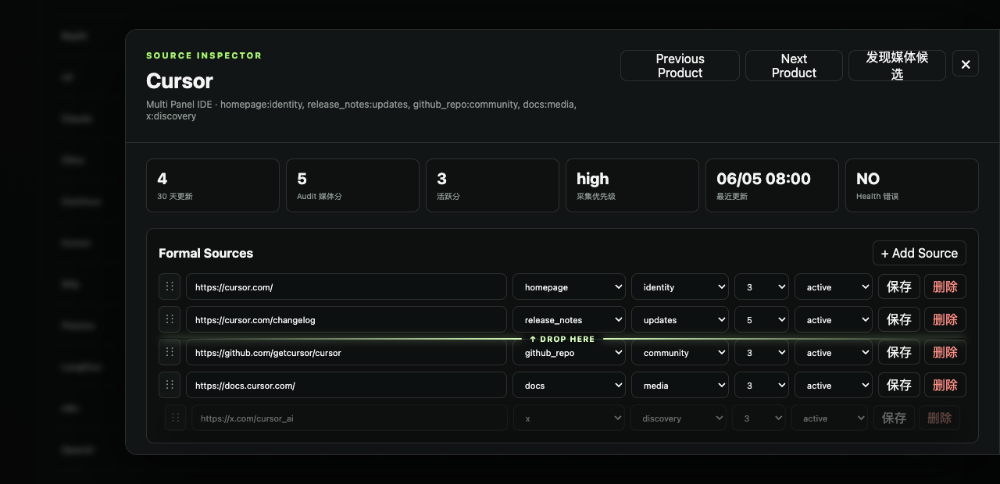

# Drag & Drop UX v2

## 验证结论

Source Inspector 的 Formal Sources 拖拽已升级为真实交互反馈，不只是修改样式名称。

- 真实鼠标拖拽排序请求返回 `200`
- 最后一条 `cursor-x` 成功移动到第一位
- 目标上半区显示 `Insert before target source`
- 目标下半区显示 `Insert after target source`
- 边缘停留触发自动滚动，测试滚动量为 `512px`
- 拖动行实际样式：透明度约 `0.39`、缩放约 `0.985`、`z-index: 4`

## 拖拽前截图说明

拖拽前列表保持紧凑行布局，左侧 `⋮⋮` 是唯一拖拽手柄，避免编辑 URL、Type、Purpose 时误触排序。

## 拖拽中反馈说明

拖动中的 source 行会变为半透明、轻微缩小并提升层级。目标边界显示高亮线和 `Drop Here` 文案：

- `↑ Drop Here`：插入目标行之前
- `↓ Drop Here`：插入目标行之后

## Drop Indicator 实现方式

`dragover` 会读取当前 hover 行的矩形区域，并用鼠标 Y 坐标与行中线比较：

- 位于上半区：`position = before`
- 位于下半区：`position = after`

Indicator 是 `.formal-source-list` 内的绝对定位 DOM 元素，不占据网格布局，因此不会推挤目标行或造成 before/after 判断抖动。它同时记录 `data-target-id` 和 `data-position`；释放时直接按这两个状态插入并保存数组顺序。

## 自动滚动实现方式

实际滚动容器是 `#inspectorDialog`。拖动指针进入容器顶部或底部约 `88px` 的边缘区域时，会计算方向和速度，并通过 `requestAnimationFrame` 持续调用 `scrollBy`：

- 越靠近顶部，向上滚动越快
- 越靠近底部，向下滚动越快
- 离开边缘、drop 或 dragend 时立即停止并清理动画帧

这让较长的 5-20 条 source 列表可以在一次拖拽中跨越当前可视区域。

## 数据说明

验证期间真实改变了 Cursor 的 source 顺序。截图和交互证据采集后，`data/sources.json` 已恢复到验证前状态，避免测试排序污染正式数据。
