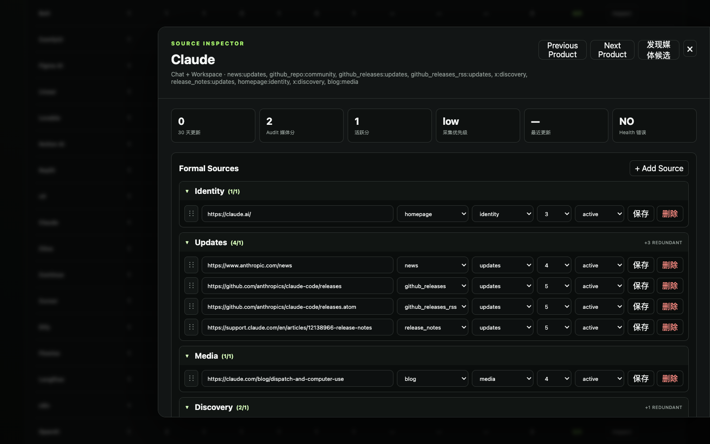

# Purpose Grouping v1

## 分组规则

Source Inspector 的 Formal Sources 会自动按 `purpose` 分为以下固定顺序：

1. Identity
2. Updates
3. Media
4. Discovery
5. Community

每条 Source 只出现在与其 `purpose` 对应的分组中。没有 Source 的分组不渲染；新增草稿默认显示在 Identity，保存时根据用户选择的 Purpose 进入目标分组底部。



## 折叠规则

- 所有分组初始默认展开。
- 点击分组标题可折叠或展开。
- 标题使用 `aria-expanded` 表达当前状态。
- 折叠只影响展示，不修改 Source 数据。

## 拖拽规则

- 拖拽仅允许在同一个 Purpose 分组内排序。
- 指针进入其他 Purpose 分组时不会显示 Drop Indicator，`dropEffect` 为 `none`。
- 保存排序时，仅替换该 Purpose 在原始 `sources[]` 中的相对槽位。
- 其他 Purpose 的 Source 顺序和数组位置不会受到影响。
- 跨组移动通过修改 Source 的 Purpose 并保存完成；保存后 Inspector 自动重新渲染，Source 进入新分组。

真实验证中，Claude Updates 的最后一条移动到第一位后，其他 Purpose 的数组槽位保持不变，排序 API 返回 `200`。

## Coverage 显示规则

每个非空分组标题显示 `当前数量/满足 Coverage 所需数量`。当前五类 Purpose 都是至少一个即可满足，因此分母固定为 `1`：

- `Identity (1/1)`：已满足
- `Updates (4/1)`：已满足，另外 3 条属于冗余覆盖
- `Discovery (2/1)`：已满足，另外 1 条属于冗余覆盖

数量超过 1 时，标题右侧额外显示 `+N redundant`。冗余 Source 提升容错和信息覆盖，但不会提高 Coverage Score。

## localStorage 持久化规则

折叠状态按产品和 Purpose 独立保存：

```text
source-inspector:{sourceId}:purpose-group:{purpose}:collapsed
```

例如 Claude Updates：

```text
source-inspector:src_claude:purpose-group:updates:collapsed
```

值为字符串 `true` 时折叠；没有记录或值不是 `true` 时默认展开。刷新页面、关闭再打开 Inspector 后仍会读取该状态。localStorage 不可用时静默退回默认展开，不影响编辑功能。

## 验证结果

- 固定分组顺序：通过
- 空分组隐藏：通过
- 标题数量与 Coverage 贡献：通过
- 折叠后刷新保持：通过
- 同组拖拽且不改变其他组：通过
- 修改 Purpose 后自动迁移：通过
- 新增 Source 进入目标组底部：通过
- 未修改 `sources.json` 数据结构
